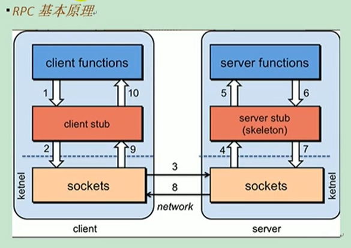

参考：http://dubbo.apache.org/en-us/docs/user/quick-start.html

### 一、RPC

> RPC：指远程过程调用，是一种进程间通信方式，允许程序调用另一个地址空间（通常是共享网络的另一台机器上）的过程或函数，而不是程序员显示编码这个远程调用的细节，即程序员无论是调用本地的还是远程的函数，本质上编写的调用代码基本相同

RPC基本原理



决定RPC框架的性能：
> - 通信：socket连接效率
> - 序列化与反序列化的方式（xml、JSON、二进制流）

dubbo角色图：


dubbo-admin/dubbo-monitor安装：https://github.com/apache/dubbo

### 二、dubbo灰度发布

> 设置version="*"，可实现随机调用新旧版本的实现方法

### 三、本地存根

> 使用rpc时，客户端通常仅是接口，但有时客户端也希望在客户端中执行部分逻辑。例如：执行ThreadLocal缓存，验证参数，在调用失败时返回模拟数据等,为了解决这个问题，您可以在API中配置存根，以便客户端生成代理实例时，它将代理Stub通过构造函数[1]传递给，然后可以在存根实现代码中实现逻辑


在spring配置文件中配置如下
```xml
<dubbo:service interface="com.foo.BarService" stub="true" />
<!--或
<dubbo:service interface="com.foo.BarService" stub="com.foo.BarServiceStub" />
-->
```

提供存根实现：
```
package com.foo;
public class BarServiceStub implements BarService {
    private final BarService barService;

    // The real remote proxy object is passed in through the constructor
    public BarServiceStub(BarService barService){
        this.barService = barService;
    }

    public String sayHello(String name) {
        // The following code is executed on the client. You can do local ThreadLocal caching on the client side, or verify parameters, etc.
        try {
            return barService.sayHello(name);
        } catch (Exception e) {
            // You can return the mock data.
            return "MockData";
        }
    }
}
```
> - 存根必须具有可以传入代理的构造函数
> - BarServiceStub实现BarService，它具有在远程BarService实例中传递的构造函数

### 四、高可用

1、zookeeper宕机与dubbo直连：zookeeper注册中心宕机，还可以消费dubbo暴露的服务，原因如下：
> - 监控中心宕机不影响使用，只是丢失部分采样数据
> - 数据库宕机之后，注册中心仍能通过缓存提供服务列表查询，但不能注册新服务
> - 注册中心对等集群，任意一台宕机后，将自动切换到另一台
> - 注册中心全部宕机后，服务提供者和服务消费者仍能通过本地缓存通讯
> - 服务提供者无状态，任意一台宕机后，不影响使用
> - 服务提供者全部宕机后，服务消费者应用将无法使用，并无限次重连等待服务提供者恢复

### 五、dubbo负载均衡配置

> 在集群负载均衡时，dubbo提供了多种均衡策略，缺省为random随机调用

负载均衡策略
> - Random LoadBalance：随机，按权重设置随机概率，在一个截面上碰撞的概率高，但调用量越大分布越均匀，而且按概率使用权重后也比较均匀，有利于动态调整提供者权重
> - RoundRobin LoadBalance：轮询，按公约后的权重设置轮询比率，存在慢的提供者累积请求的问题，比如：第二台机器很慢，但没挂，当请求调到第二台时旧卡在那，久而久之，所有请求都卡在调到的第二台上
> - LeastActive LoadBalance：最少活跃数，是一种基于活动变量的随机机制，actives表示消费者已发送但尚未返回的请求数量，速度较慢的提供者将收到较少的请求，因为速度较慢的提供者将收到较高的请求actives
> - ConsistentHash LoadBalance：一致性hash，始终将请求的相同参数发送到相同的提供程序，当提供程序失败时，基于虚拟节点算法的对提供程序的原始请求将平均到其他提供程序，不会引起急剧的变化

### 六、集群容错
> - 设置重试次数
> - FailFast Cluster：快速失败，只发起一次调用，失败立即报错，通常用于非幂等性的写操作，比如新增记录
> - FailSafe Cluster：失败安全，出现异常时，直接忽略，通常用于写入审计日志等操作
> - FailBack Cluster：失败自动恢复，后台记录失败请求，定时重发，通常用于消息通知操作
> - Forking Cluster：并行调用多个服务器，只要一个成功即返回，通常用于实时性要求较高的读操作，但需要浪费更多服务资源，可通过forks="2"来设置最大并行数
> - BroadCast Cluster：广播调用所有提供者，逐个调用，任意一台报错则报错，通常用于通知所有提供者更新缓存或日志等本地资源信息
> - 集群模式配置：按照以下示例在服务提供方和消费方配置集群模式：<dubbo:service cluster="failsafe"/> 或 <dubbo:reference cluster="failsafe"/>

### 七、dubbo netty通信原理（NIO）

BIO(blocking-io)


NIO(non-blocking-io)


> - selector一般成为选择器，即多路复用器
> - connect（连接就绪）、accept（接收就绪）、read（读就绪）、write（写就绪）

### 七、dubbo协议
> - dubbo协议：dubbo 缺省协议 采用单一长连接和NIO异步通讯，适合于小数据量大并发的服务调用，以及服务消费者机器数远大于服务提供者机器数的情况，不适合传送大数据量的服务，比如传文件，传视频等，除非请求量很低。
> - rmi协议：RMI协议采用JDK标准的java.rmi.*实现，采用阻塞式短连接和JDK标准序列化方式 。
> - hessian协议：Hessian 协议用于集成 Hessian 的服务，Hessian 底层采用 Http 通讯，采用 Servlet 暴露服务，Dubbo 缺省内嵌 Jetty 作为服务器实现。
> - http协议：基于http表单的远程调用协议。
> - webservice协议：基于 WebService 的远程调用协议，基于 Apache CXF的 frontend-simple 和 transports-http 实现。
> - thrift协议：当前 dubbo 支持的 thrift 协议是对 thrift 原生协议 [2] 的扩展，在原生协议的基础上添加了一些额外的头信息，比如 service name，magic number 等。
> - memcached协议：基于 memcached实现的 RPC 协议。
> - redis协议：基于 Redis实现的 RPC 协议。
> - rest协议：restful

参考：https://blog.csdn.net/xiaojin21cen/article/details/79834222


